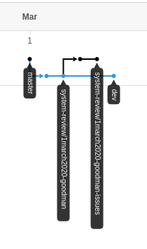

# system-review-example
The repository demonstrates how to review system.
## Instructions
1. Choose repository's state you want to review, e.g. some commit in dev branch:
https://github.com/oktend/system-review-example/commit/0514531a35edf19e7032eb49f45a98d019f83efe
1. Branch from it with new system review brancg, e.g. "system-review/1march2020-goodman"
https://github.com/oktend/system-review-example/tree/system-review/1march2020-goodman
1. Create new branch for issues form newly created branch: 1march2020-goodman -> 1march2020-goodman-issues:
https://github.com/oktend/system-review-example/tree/system-review/1march2020-goodman-issues
1. Push any notes just in code, dedicated files for review or any other place.
1. Create pull request from issues branch to system review's branch:
https://github.com/oktend/system-review-example/pull/1/files
Your branches now look something like this:
https://github.com/oktend/system-review-example/network

Now you are able to see all notes in github's web-interface (or in analogical systems), or just in your IDE.

## Benefits
1. You make notes in code context. You do not need put complex references in docs. 
1. You fix state of the system to comment. Development can go on. 
1. You do not need extra tools for this approach. Use the same git.
